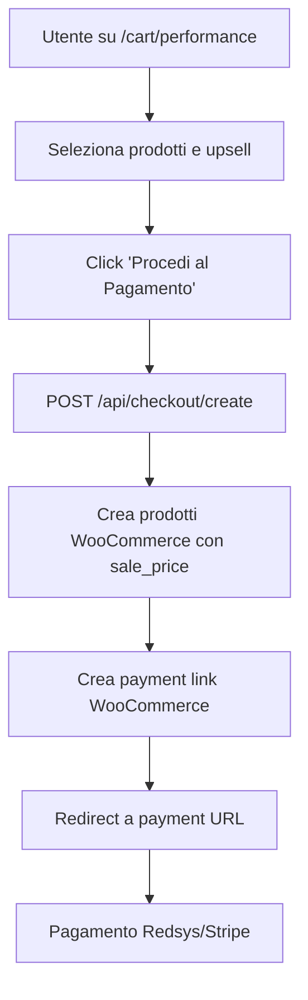
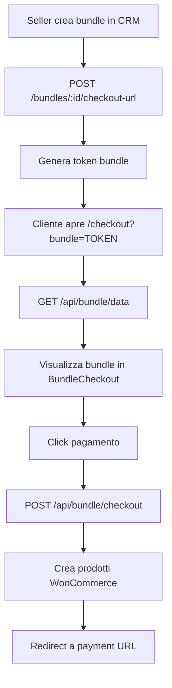

# 🛒 Sistema Carrelli e Sconti - Documentazione Completa

## 📋 Panoramica

Sistema completo per la gestione di carrelli e-commerce con supporto per:
- ✅ Sconti automatici tramite WooCommerce `sale_price`
- ✅ Upsell con sconti opzionali
- ✅ Bundle configurabili dal CRM
- ✅ Referral code tracking
- ✅ Creazione dinamica prodotti WooCommerce

---

## 🏗️ Architettura

### Backend API

#### 1. WooCommerce Helper (`/lib/woocommerce.ts`)
Libreria per gestire prodotti e payment links WooCommerce:

```typescript
// Crea prodotto con sconto
await createWooProduct({
  name: 'Prodotto Test',
  regular_price: '100.00',
  sale_price: '80.00',  // Sconto automatico!
  status: 'publish'
});

// Crea checkout completo
await createCheckoutWithProducts(
  products,
  customer,
  { gateway: 'redsys', metadata: {...} }
);
```

**Funzionalità:**
- `createWooProduct()` - Crea prodotto singolo
- `createPaymentLink()` - Genera payment link
- `createCheckoutWithProducts()` - Workflow completo

#### 2. API Checkout Create (`/app/api/checkout/create/route.ts`)
Endpoint principale per creare checkout da pagine cart.

**Endpoint:** `POST /api/checkout/create`

**Request Body:**
```json
{
  "products": [
    {
      "id": "performance-pro",
      "quantity": 1
    }
  ],
  "upsells": ["performance-ai-optimization"],
  "referral_code": "SELLER123",
  "cart_type": "performance"
}
```

**Response:**
```json
{
  "success": true,
  "payment_url": "https://checkout.allyoucanleads.com/...",
  "order_id": 256,
  "total": "2499.00"
}
```

**Catalogo Prodotti Supportati:**

##### Setup Fee
- `setup-fee-basic` - €2,500 → €1,999 ✨
- `setup-advanced-training` - €500
- `setup-custom-integration` - €750

##### Drive Test
- `drive-test-standard` - €500 → €399 ✨
- `drive-test-extended` - €300
- `drive-test-premium-support` - €200
- `drive-test-advanced-analytics` - €150

##### Performance
- `performance-starter` - €1,500 → €1,199 ✨
- `performance-pro` - €2,500 → €1,999 ✨
- `performance-enterprise` - €5,000 → €3,999 ✨
- `performance-ai-optimization` - €500
- `performance-multi-channel` - €750
- `performance-crm-integration` - €400

##### Bundles
- `bundle-complete` - €7,500 → €4,999 ✨
- `bundle-starter` - €3,500 → €2,499 ✨
- `bundle-growth` - €5,500 → €3,699 ✨
- `bundle-white-label` - €2,000
- `bundle-api-access` - €1,000
- `bundle-consulting` - €1,500

#### 3. API Bundle System

##### Bundle Data (`/app/api/bundle/data/route.ts`)
Recupera dati bundle dal CRM.

**Endpoint:** `GET /api/bundle/data?token=BUNDLE_TOKEN`

**Response:**
```json
{
  "id": "uuid",
  "name": "Bundle Enterprise",
  "products": [...],
  "discount_type": "percentage",
  "discount_value": 20,
  "subtotal": 10000,
  "discount_amount": 2000,
  "total": 8000,
  "includes_upsell": true,
  "upsell_name": "White Label",
  "upsell_price": 2000
}
```

##### Bundle Checkout (`/app/api/bundle/checkout/route.ts`)
Crea checkout WooCommerce per bundle.

**Endpoint:** `POST /api/bundle/checkout`

**Request Body:**
```json
{
  "bundle": { ...bundleData },
  "referral_code": "SELLER123"
}
```

---

## 🎨 Frontend

### Pagine Cart

Tutte le pagine cart seguono lo stesso pattern:

#### 1. **Setup Fee** - `/cart/setup-fee`
```typescript
const products = [
  {
    id: 'setup-fee-basic',
    name: 'Setup Fee - Pacchetto Base',
    regular_price: 2500,
    sale_price: 1999,  // Sconto visualizzato!
    features: [...]
  }
];

const upsells = [
  {
    id: 'setup-advanced-training',
    name: 'Training Avanzato',
    price: 500,
    // Opzionale: regular_price e sale_price per upsell scontati
    features: [...]
  }
];
```

#### 2. **Drive Test** - `/cart/drive-test`
```typescript
const products = [
  {
    id: 'drive-test-standard',
    name: 'Drive Test - 30 Giorni',
    regular_price: 500,
    sale_price: 399,
    features: [...]
  }
];
```

#### 3. **Performance** - `/cart/performance`
Tre tier con sconti:
- Starter: €1,500 → €1,199
- Pro: €2,500 → €1,999
- Enterprise: €5,000 → €3,999

#### 4. **Bundles** - `/cart/bundles`
Bundle predefiniti o dinamici dal CRM.

### Componente CartCheckout (`/components/cart-checkout.tsx`)

Componente universale per tutte le pagine cart.

**Props:**
```typescript
interface CartCheckoutProps {
  title: string;
  subtitle: string;
  products: Product[];
  upsells?: Upsell[];
  onCheckout: (products, upsells) => Promise<void>;
  referralCode?: string;
}
```

**Features:**
- ✅ Visualizza prodotti con sconti
- ✅ Mostra percentuale di risparmio
- ✅ Selezione upsell multipli
- ✅ Calcolo totale dinamico
- ✅ Gestione errori
- ✅ Loading states
- ✅ Supporto upsell scontati

**Visualizzazione Sconti:**
- Badge sconto percentuale sul prodotto
- Prezzo originale barrato
- Prezzo scontato evidenziato
- Box risparmio totale verde

---

## 🔄 Flusso Completo

### Flusso 1: Pagina Cart → Checkout



### Flusso 2: Bundle dal CRM → Checkout



---

## 🔧 Configurazione Ambiente

### Variabili Richieste

```env
# WooCommerce / Checkout API
NEXT_PUBLIC_CHECKOUT_API_URL=https://checkout.allyoucanleads.com
WC_INBOUND_TOKEN=your_woocommerce_token

# CRM Backend API
NEXT_PUBLIC_API_URL=http://localhost:4000
CRM_API_BASE=http://localhost:3001
CRM_API_TOKEN=your_crm_token
```

---

## 📚 Guide Implementazione

### Come Aggiungere un Nuovo Prodotto

1. **Aggiungi al catalogo** in `/app/api/checkout/create/route.ts`:

```typescript
const PRODUCT_CATALOG: Record<string, ProductDefinition> = {
  // ... prodotti esistenti
  'nuovo-prodotto': {
    name: 'Nuovo Prodotto Fantastico',
    description: 'Descrizione del prodotto',
    regular_price: 1000,
    sale_price: 799, // Opzionale
  }
};
```

2. **Crea pagina cart** (o aggiungila a una esistente):

```typescript
// /app/cart/nuova-categoria/page.tsx
const products = [
  {
    id: 'nuovo-prodotto',
    name: 'Nuovo Prodotto Fantastico',
    regular_price: 1000,
    sale_price: 799,
    features: [...]
  }
];
```

### Come Aggiungere Sconti agli Upsell

Gli upsell ora supportano sconti! Basta aggiungere i campi:

```typescript
const upsells = [
  {
    id: 'upsell-scontato',
    name: 'Super Upsell',
    price: 500,           // Mantieni per compatibilità
    regular_price: 500,   // Prezzo originale
    sale_price: 399,      // Prezzo scontato!
    features: [...]
  }
];
```

Il componente `CartCheckout` lo gestirà automaticamente, mostrando:
- Prezzo originale barrato
- Prezzo scontato in verde
- Risparmio totale aggiornato

### Come Testare il Sistema

1. **Test Prodotto Singolo:**
```bash
curl -X POST http://localhost:3000/api/checkout/create \
  -H "Content-Type: application/json" \
  -d '{
    "products": [{"id": "performance-pro", "quantity": 1}],
    "cart_type": "performance"
  }'
```

2. **Test con Upsell:**
```bash
curl -X POST http://localhost:3000/api/checkout/create \
  -H "Content-Type: application/json" \
  -d '{
    "products": [{"id": "setup-fee-basic", "quantity": 1}],
    "upsells": ["setup-advanced-training"],
    "referral_code": "SELLER123",
    "cart_type": "setup-fee"
  }'
```

3. **Test Bundle:**
```bash
# 1. Crea bundle in CRM
# 2. Ottieni checkout URL
# 3. Apri URL nel browser
# 4. Verifica prezzi e sconti
```

---

## 🐛 Troubleshooting

### Problema: Sconto non visualizzato
**Causa:** `sale_price` >= `regular_price` o mancante  
**Soluzione:** Verifica che `sale_price < regular_price`

### Problema: Payment link fallisce
**Causa:** Token WooCommerce invalido  
**Soluzione:** Verifica `WC_INBOUND_TOKEN` in `.env`

### Problema: Bundle non carica
**Causa:** Token bundle scaduto o invalido  
**Soluzione:** Genera nuovo checkout URL dal CRM

### Problema: Referral code non tracciato
**Causa:** Non passato alla API  
**Soluzione:** Includi `?ref=CODE` nell'URL o nel body

---

## 📈 Best Practices

### Sconti
1. ✅ Usa sempre `sale_price` per sconti WooCommerce
2. ✅ Non superare mai il 70% di sconto (sembra sospetto)
3. ✅ Mostra chiaramente il risparmio
4. ✅ Considera bundle per sconti maggiori

### UX
1. ✅ Mostra badge sconto percentuale
2. ✅ Usa colori distintivi (verde per risparmio, rosso per sconto)
3. ✅ Totale sempre visibile
4. ✅ Loading states durante checkout

### Performance
1. ✅ Cache prodotti WooCommerce quando possibile
2. ✅ Usa `cache: 'no-store'` per bundle dinamici
3. ✅ Parallel requests per prodotti multipli

### Sicurezza
1. ✅ Valida sempre i prezzi server-side
2. ✅ Non esporre token interni
3. ✅ Rate limiting su API pubbliche

---

## 🚀 Roadmap Future

### Fase 1 - Completata ✅
- [x] Sistema base carrelli
- [x] Sconti automatici WooCommerce
- [x] Bundle dal CRM
- [x] Upsell con sconti

### Fase 2 - Da Fare
- [ ] Upsell configurabili dinamicamente dal seller
- [ ] A/B testing prezzi e sconti
- [ ] Analytics sconti (conversion rate per tipo)
- [ ] Dynamic pricing basato su geo/comportamento
- [ ] Coupon codes aggiuntivi
- [ ] Cross-sell intelligenti con ML

### Fase 3 - Future
- [ ] Subscription bundles
- [ ] Pay-what-you-want pricing
- [ ] Volume discounts automatici
- [ ] Flash sales / Time-limited offers
- [ ] Loyalty program integration

---

## 📞 Supporto

Per domande o problemi:
- 📧 Email: dev@allyoucanleads.com
- 📚 Docs: Questo file
- 🐛 Issues: GitHub repository

---

**Ultima modifica:** Ottobre 2025  
**Versione:** 2.0.0  
**Autore:** AYCL Development Team

